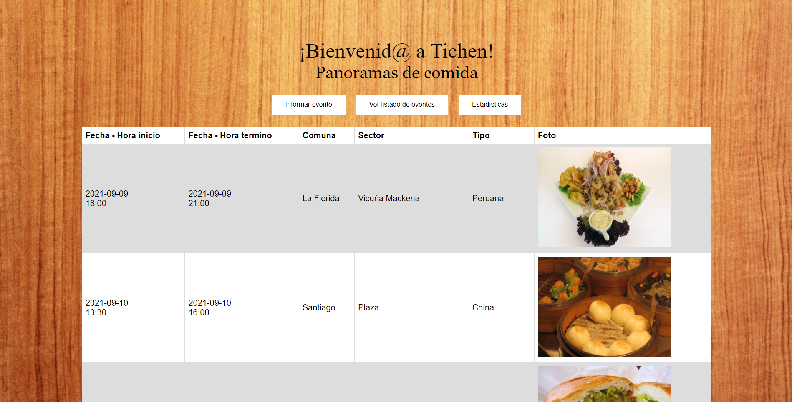
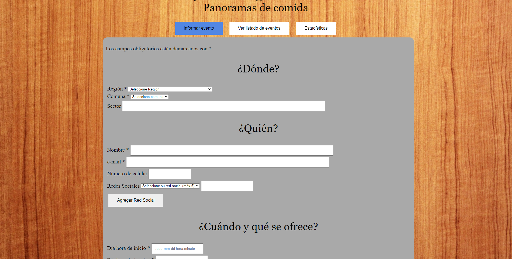
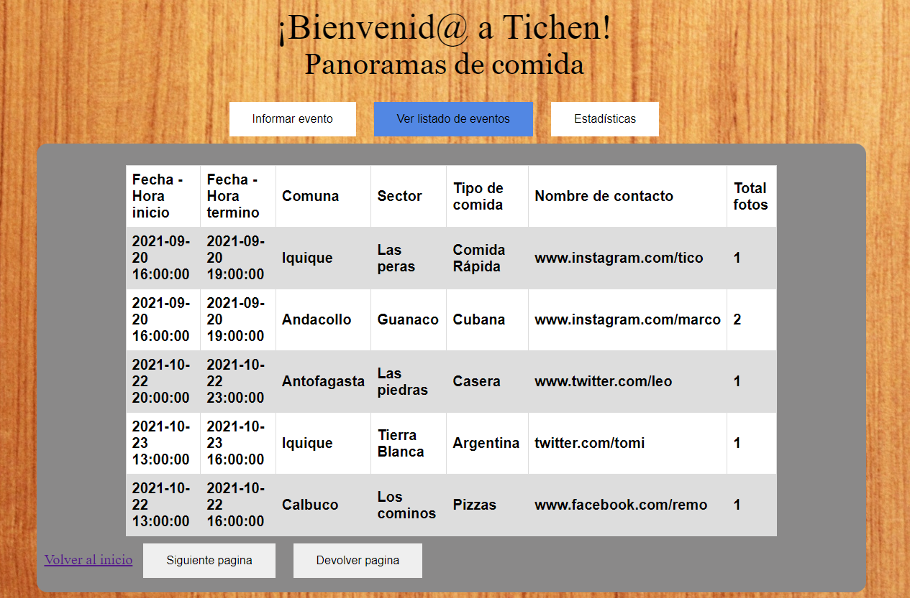
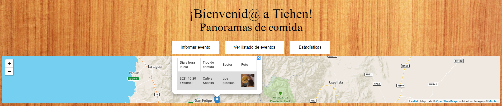
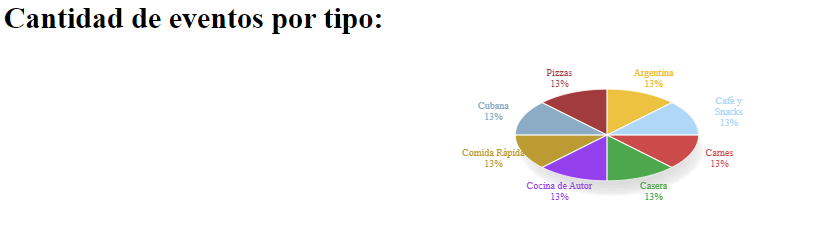

# CC5002-Aplicaciones-Web

Repositorio correspondiente al curso Desarrollo de Aplicaciones Web. Se encuentran las tareas realizadas durante el curso. El desarrollo de esta aplicación web es incremental donde en cada entrega se le agregan funcionalidades.

# Motivación

Para fomentar el consumo de comida se desarrolla una aplicación web que permita a los usurios ver los eventos incritos en la pagina e informar si se desea de un nuevo evento. Estos constan con información como fecha de inicio y fecha de termino, tipo de comida, fotos, lugar del evento, etc. También existe una sección para ver estadísticas respecto a la cantidad de eventos incritos por tipo de comida, por cantidad inscritas a lo largo del tiempo y por cantidad de eventos en la mañana, tarde o noche.

# Tarea 1

Simular y desarrollar pagina que permite a los empresarios informar un nuevo evento de comida con cierta fecha (inicio - fin). Se busca desarrollar un prototipo de esta aplicación con HTML, CSS y JavaScript.

# Tarea 2

Desarrollar la pagina de eventos para que pueda guardar y consultar eventos guardados recientemente con una base de datos.

A continuación una imagen del formulario para inscribir un evento:

En la siguiente imagen se puede ver un listado de los últimos 5 eventos inscritos:

# Tarea 3

Desarrollar la pagina de eventos para que pueda recolectar los datos del servidor para luego graficarlos usando AJAX. Adicionalmente se implementa el uso de un mapa que permite visualizar los eventos inscritos a traves de la libreria [Leaflet](https://leafletjs.com/).

La siguiente imagen permite ver el mapa con la ubicación de un evento inscrito en la página:

En esta imagen se puede ver la cantidad de eventos por tipos obtenido a partir de la base de datos:

